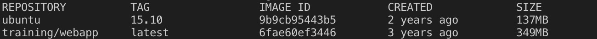
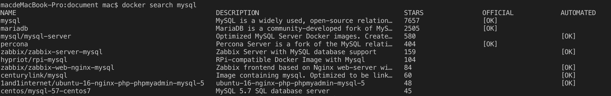

### 1. Docker 镜像使用
当使用镜像时，如果本地不存在镜像，那么会从docker镜像仓库下载，默认是从Docker Hub下载。本节学习
* 1、管理和使用本地Docker主机镜像
* 2、创建镜像

---
### 2. 列出镜像列表
<pre>
docker images
</pre>
我们可以使用以上命令列出本地镜像列表  

各个选项说明:  
<pre>
* REPOSITORY: 表示镜像的仓库源
* TAG: 镜像的标签
* IMAGE ID: 镜像id
* CREATED: 镜像创建时间
* SIZE: 镜像大小  
</pre>
同一个仓库可以有多个TAG,代表这个仓库源的不同的版本,我们使用REPOSITORY:TAG来定义不同的镜像 

---
### 3. 获取一个新的镜像 
当我们使用一个本地不存在的镜像时，docker就会从镜像仓库下载这个镜像。如果我们想预先下载这个镜像，那么可以使用以下命令
<pre>
docker pull [REPOSITORY]:[TAG]
</pre>  
eg: docker pull ubuntu:13.10  
下载完成后，就可以使用这个镜像运行容器了  

---
### 4.查找镜像  
我们可以从Docker Hub搜索镜像，地址为https://hub.docker.com.  
<pre>
docker search mysql
docker pull mysql
docker run mysql
</pre>
我们也可以使用以下命令进行查找,展示界面如下:

参数解析:
* NAME: 镜像仓库源的名称  
* DESCRIPTION: 镜像的描述  
* OFFICIAL: 是否由官方发布的  

---
### 5.创建对象  
当我们从docker仓库中下载的镜像不能满足我们的需求时，我们可以t通过以下两个方式进行更改。
* 1.从已创建好的镜像中更新对象，并且提交  
* 2.使用dockerfile指令来创建一个新的对象  

--- 
### 6.构建对象  
<pre>
docker build
</pre>
我们可以使用以上指令来从零开始构建一个新的镜像。为此，我们需要创建一个新的Dockerfile文件，其中包含一组指令来告诉docker如何构建我们的镜像。
<pre>
runoob@runoob:~$ cat Dockerfile 
FROM    centos:6.7
MAINTAINER      Fisher "fisher@sudops.com"

RUN     /bin/echo 'root:123456' |chpasswd
RUN     useradd runoob
RUN     /bin/echo 'runoob:123456' |chpasswd
RUN     /bin/echo -e "LANG=\"en_US.UTF-8\"" >/etc/default/local
EXPOSE  22
EXPOSE  80
CMD     /usr/sbin/sshd -D
</pre>
每一个指令都会创建一个新的层，每一条指令都必须大写  
参数解读:  
* FROM: 指定使用哪个镜像源
* MAINTAINER: 指定作者
* RUN: 告诉docker要在镜像内运行什么或者安装什么  
然后我们使用Dockerfile文件，通过docker build命令来构建一个镜像。
<pre>
docker build -t runoob/centos:6.7 .
</pre>
参数解读:
* -t: 指定要创建的目标镜像名
* .: Dockerfile所在的目录，可以指定Dockerfile的绝对路径
  
### 7.设置镜像标签
<pre>
docker tag [id] [username]/[imageName]:[newTagName]
</pre>
eg: docker tag 860c279d2fec runoob/centos:dev
我们可以使用docker tag为镜像添加新的标签。

